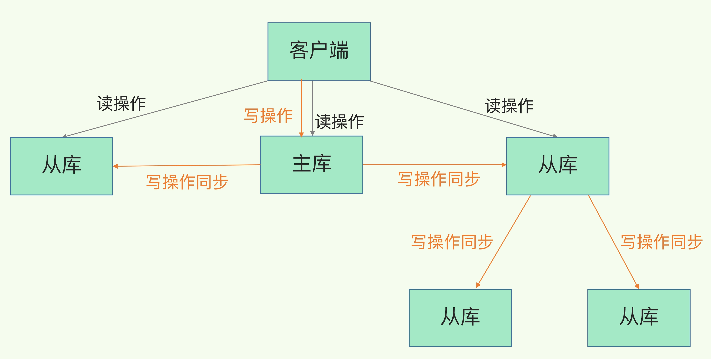
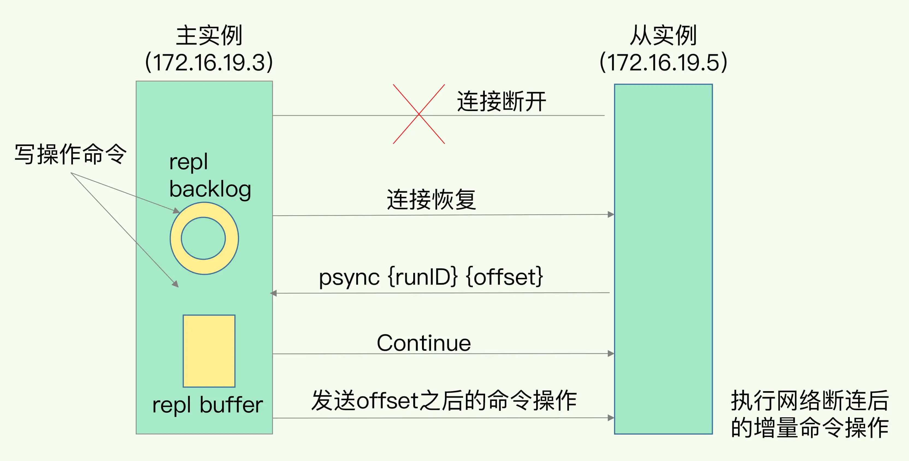
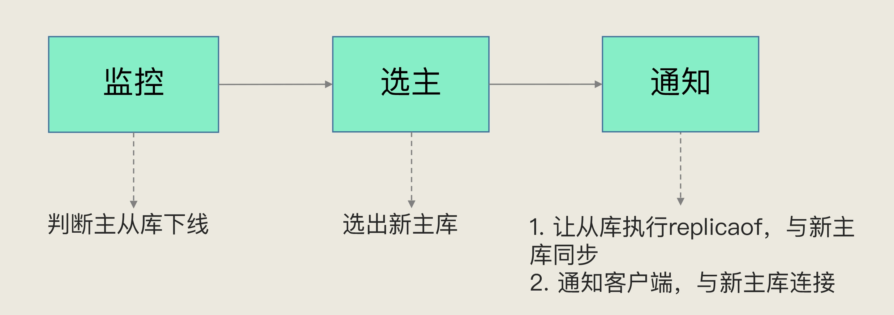
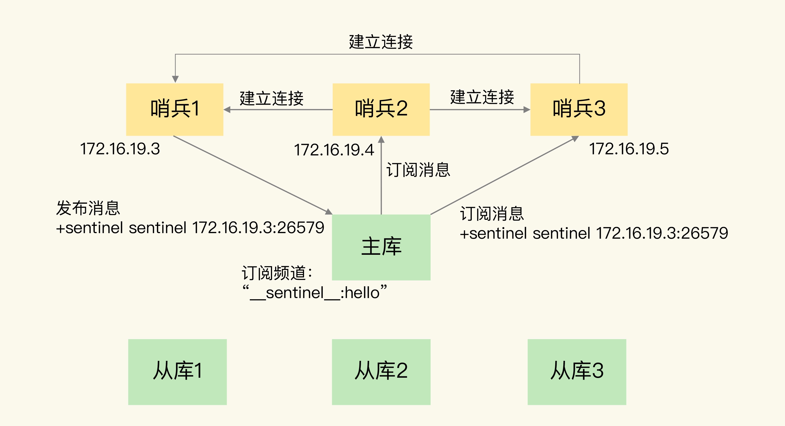
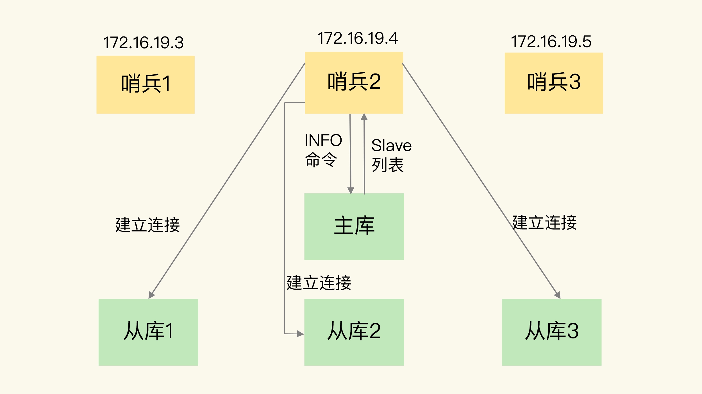
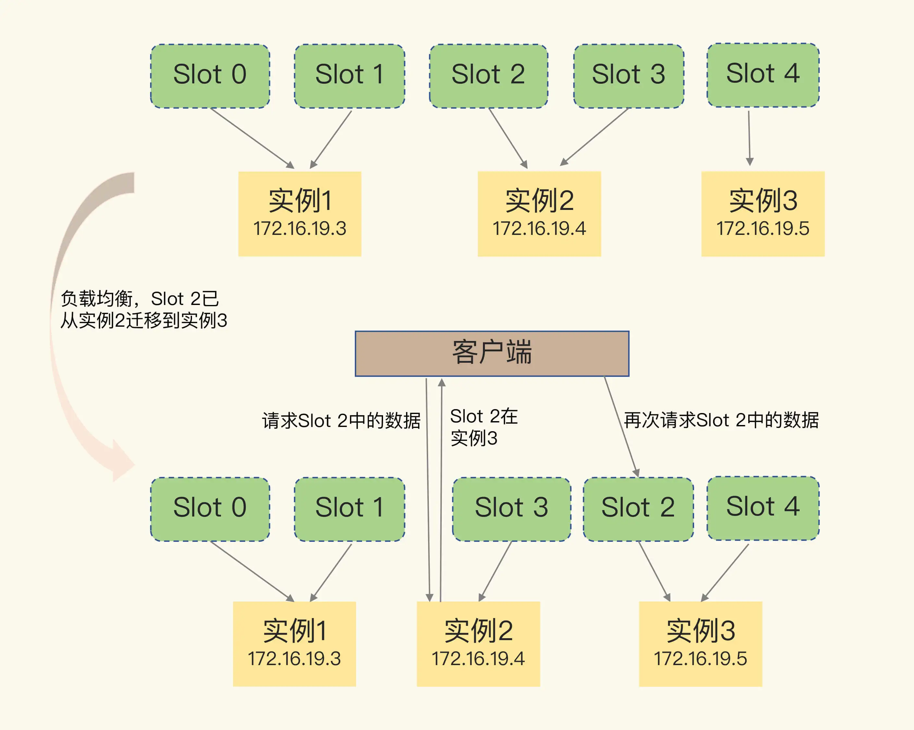

持续记录面试过程中关于Redis的热门问题。

[TOC]

---

Redis 具有高可靠性，有两层含义：

1. 一是数据尽量少丢失（AOF 和 RDB）
2. 二是服务尽量少中断（增加副本冗余量）


# 1. 数据同步：主从库

Redis 提供了主从库模式，以保证数据副本的一致，主从库之间采用的是读写分离的方式。所有数据的修改只会在主库上进行，主库有了最新的数据后，会同步给从库，这样，主从库的数据就是一致的。

- 读操作：主库、从库都可以接收；
- 写操作：首先到主库执行，然后，主库将写操作同步给从库

## 1.1 主从库首次同步
启动多个 Redis 实例的时候，它们相互之间就可以通过 replicaof（Redis 5.0 之前使用 slaveof）命令形成主库和从库的关系。


- 第一阶段：主从库间建立连接、协商同步的过程，为全量复制做准备。从库给主库发送 psync 命令，表示要进行数据同步，主库根据这个命令的参数来启动复制。psync 命令包含了主库的 runID 和复制进度 offset 两个参数。

  - runID，是每个 Redis 实例启动时都会自动生成的一个随机 ID，用来唯一标记这个实例。当从库和主库第一次复制时，因为不知道主库的 runID，所以将 runID 设为“？”
  - offset，此时设为 -1，表示第一次复制

  主库收到 psync 命令后，会用 FULLRESYNC 响应命令带上两个参数：主库 runID 和主库目前的复制进度 offset，返回给从库。**FULLRESYNC 响应表示第一次复制采用的全量复制，也就是说，主库会把当前所有的数据都复制给从库。**

- 第二阶段，主库将所有数据同步给从库。从库收到数据后，在本地完成数据加载。这个过程依赖于内存快照生成的 RDB 文件。
  主库执行 bgsave 命令，生成 RDB 文件，接着将文件发给从库。从库接收到 RDB 文件后，会先清空当前数据库，然后加载 RDB 文件。
  在主库将数据同步给从库的过程中，主库不会被阻塞，仍然可以正常接收请求。为了保证主从库的数据一致性，主库会在内存中用专门的 replication buffer，记录 RDB 文件生成后收到的所有写操作。

- 第三个阶段，主库会把第二阶段执行过程中新收到的写命令，再发送给从库。主库完成 RDB 文件发送后，就会把此时 replication buffer 中的修改操作发给从库，从库再重新执行这些操作。


## 1.2 主从级联模式：分担全量复制时的主库压力

一次全量复制中，对于主库来说，需要完成两个耗时的操作：生成 RDB 文件和传输 RDB 文件。如果从库数量很多，而且都要和主库进行全量复制的话，就会导致

- 主库忙于 fork 子进程生成 RDB 文件，进行数据全量同步。fork 这个操作会阻塞主线程处理正常请求，从而导致主库响应应用程序的请求速度变慢。
- 传输 RDB 文件也会占用主库的网络带宽，同样会给主库的资源使用带来压力

可以通过“主 - 从 - 从”模式将主库生成 RDB 和传输 RDB 的压力，以级联的方式分散到从库上。



一旦主从库完成了全量复制，它们之间就会一直维护一个网络连接，主库会通过这个连接将后续陆续收到的命令操作再同步给从库，这个过程也称为基于长连接的命令传播，可以避免频繁建立连接的开销。这个过程中存在着风险点，最常见的就是网络断连或阻塞。如果网络断连，主从库之间就无法进行命令传播。


## 1.3 主从库间网络断了怎么办？

- Redis 2.8 之前，如果主从库在命令传播时出现了网络闪断，那么，从库就会和主库重新进行一次全量复制，开销非常大
- Redis 2.8 开始，网络断了之后，主从库会采用增量复制的方式继续同步。增量复制只会把主从库网络断连期间主库收到的命令，同步给从库。

主从库断连后，主库会把断连期间收到的写操作命令，写入 replication buffer，同时也会把这些操作命令也写入 repl_backlog_buffer 这个缓冲区。repl_backlog_buffer 是一个环形缓冲区，主库会记录自己写到的位置，从库则会记录自己已经读到的位置。对主库来说，对应的偏移量就是 master_repl_offset。从库对应的偏移量是 slave_repl_offset 。

**网络重连后的主从同步**



- 从库首先会给主库发送 psync 命令，并把自己当前的 slave_repl_offset 发给主库，主库会判断自己的 master_repl_offset 和 slave_repl_offset 之间的差距。
- 主库只用把 master_repl_offset 和 slave_repl_offset 之间的命令操作同步给从库就行

**风险点**

**因为 repl_backlog_buffer 是一个环形缓冲区，所以在缓冲区写满后，主库会继续写入，此时，就会覆盖掉之前写入的操作。如果从库的读取速度比较慢，就有可能导致从库还未读取的操作被主库新写的操作覆盖了，这会导致主从库间的数据不一致。**

解决办法：

- 调整 repl_backlog_size 这个参数，设置的大一点，那么增量复制时主从库的数据不一致风险就降低了
- 考虑使用切片集群来分担单个主库的请求压力


## 1.4 小结

Redis 的主从库同步的基本原理有三种模式：

- 全量复制

  全量复制虽然耗时，但是对于从库来说，如果是第一次同步，全量复制是无法避免的，所以，我给你一个小建议：一个 Redis 实例的数据库不要太大，一个实例大小在几 GB 级别比较合适，这样可以减少 RDB 文件生成、传输和重新加载的开销。也可以采用“主 - 从 - 从”这一级联模式，来缓解主库的压力。

- 基于长连接的命令传播

- 增量复制
  注意 repl_backlog_size 这个参数，通过调大这个参数，可以减少从库在网络断连时全量复制的风险。

**Q1. AOF 记录的操作命令更全，相比于 RDB 丢失的数据更少。那么，为什么主从库间的复制不使用 AOF 呢？**

<details>
<summary>展开</summary>
    &emsp;1、RDB文件内容是经过压缩的二进制数据（不同数据类型数据做了针对性优化），文件很小。而AOF文件记录的是每一次写操作的命令，写操作越多文件会变得很大，其中还包括很多对同一个key的多次冗余操作。在主从全量数据同步时，传输RDB文件可以尽量降低对主库机器网络带宽的消耗，从库在加载RDB文件时，一是文件小，读取整个文件的速度会很快，二是因为RDB文件存储的都是二进制数据，从库直接按照RDB协议解析还原数据即可，速度会非常快，而AOF需要依次重放每个写命令，这个过程会经历冗长的处理逻辑，恢复速度相比RDB会慢得多，所以使用RDB进行主从全量同步的成本最低。<br>
    &emsp;2、假设要使用AOF做全量同步，意味着必须打开AOF功能，打开AOF就要选择文件刷盘的策略，选择不当会严重影响Redis性能。而RDB只有在需要定时备份和主从全量同步数据时才会触发生成一次快照。而在很多丢失数据不敏感的业务场景，其实是不需要开启AOF的。

</details>


**Q2. repl_backlog_buffer和replication buffer 的联系和区别**

<details>
<summary>展开</summary>
    &emsp;1、repl_backlog_buffer：就是上面我解释到的，它是为了从库断开之后，如何找到主从差异数据而设计的环形缓冲区，从而避免全量同步带来的性能开销。如果从库断开时间太久，repl_backlog_buffer环形缓冲区被主库的写命令覆盖了，那么从库连上主库后只能乖乖地进行一次全量同步，所以repl_backlog_buffer配置尽量大一些，可以降低主从断开后全量同步的概率。而在repl_backlog_buffer中找主从差异的数据后，如何发给从库呢？这就用到了replication buffer。<br>
    &emsp;2、replication buffer：Redis和客户端通信也好，和从库通信也好，Redis都需要给分配一个 内存buffer进行数据交互，客户端是一个client，从库也是一个client，我们每个client连上Redis后，Redis都会分配一个client buffer，所有数据交互都是通过这个buffer进行的：Redis先把数据写到这个buffer中，然后再把buffer中的数据发到client socket中再通过网络发送出去，这样就完成了数据交互。所以主从在增量同步时，从库作为一个client，也会分配一个buffer，只不过这个buffer专门用来传播用户的写命令到从库，保证主从数据一致，我们通常把它叫做replication buffer。<br>
    &emsp;3. 既然有这个内存buffer存在，那么这个buffer有没有限制呢？如果主从在传播命令时，因为某些原因从库处理得非常慢，那么主库上的这个buffer就会持续增长，消耗大量的内存资源，甚至OOM。所以Redis提供了client-output-buffer-limit参数限制这个buffer的大小，如果超过限制，主库会强制断开这个client的连接，也就是说从库处理慢导致主库内存buffer的积压达到限制后，主库会强制断开从库的连接，此时主从复制会中断，中断后如果从库再次发起复制请求，那么此时可能会导致恶性循环，引发复制风暴，这种情况需要格外注意。
</details>


# 2. 哨兵机制：主从切换

三连问：

1. 主库真的挂了吗？
2. 该选择哪个从库作为主库？
3. 怎么把新主库的相关信息通知给从库和客户端呢？

在 Redis 主从集群中，哨兵机制是实现主从库自动切换的关键机制，它有效地解决了主从复制模式下故障转移的这三个问题。


## 2.1 哨兵机制的基本流程

哨兵主要负责的就是三个任务：监控、选主（选择主库）和通知。




## 2.2 监控：主观下线和客观下线

### 2.2.1 主观下线

监控是指哨兵进程在运行时，周期性地给所有的主从库发送 PING 命令，检测它们是否仍然在线运行。如果从库没有在规定时间内响应哨兵的 PING 命令，哨兵就会把它标记为“下线状态”；同样，如果主库也没有在规定时间内响应哨兵的 PING 命令，哨兵就会判定主库下线，然后开始自动切换主库的流程。

哨兵进程会使用 PING 命令检测它自己和主、从库的网络连接情况，用来判断实例的状态。如果哨兵发现主库或从库对 PING 命令的响应超时了，那么，哨兵就会先把它标记为“主观下线”。

- 如果检测的是从库，那么，哨兵简单地把它标记为“主观下线”就行了。从库的下线影响一般不太大，集群的对外服务不会间断
- 如果检测的是主库，不能简单地把它标记为“主观下线”。为了避免误判带来的不必要的开销（后续的选主和通知操作都会带来额外的计算和通信开销），需要哨兵集群一起判断，只有大多数的哨兵实例，都判断主库已经“主观下线”了，主库才会被标记为“客观下线”
  **注：多实例组成的集群模式进行部署，这也被称为哨兵集群**

### 2.2.2 客观下线

“客观下线”的标准就是，当有 N 个哨兵实例时，最好要有 N/2 + 1 个实例判断主库为“主观下线”，才能最终判定主库为“客观下线”。这样一来，就可以减少误判的概率，也能避免误判带来的无谓的主从库切换。


## 2.3 选主

哨兵选择新主库的过程称为“筛选 + 打分”

### 2.3.1 筛选

1. 先保证所选的从库仍然在线运行
2. 除了要检查从库的当前在线状态，还要判断它之前的网络连接状态（具体怎么判断呢？你使用配置项 down-after-milliseconds * 10。其中，down-after-milliseconds 是我们认定主从库断连的最大连接超时时间。如果在 down-after-milliseconds 毫秒内，主从节点都没有通过网络联系上，我们就可以认为主从节点断连了。如果发生断连的次数超过了 10 次，就说明这个从库的网络状况不好，不适合作为新主库。）

### 2.3.2 打分

可以分别按照三个规则依次进行三轮打分，这三个规则分别是

- 从库优先级
  优先级最高的从库得分高，可以通过 slave-priority 配置项，给不同的从库设置不同优先级。例如，给内存大的实例设置一个高优先级。

- 从库复制进度
  和旧主库同步程度最接近的从库得分高。（slave_repl_offset 需要最接近 master_repl_offset）
- 从库 ID 号
  ID 号小的从库得分高


# 3. 哨兵集群

三连问：

1. 哨兵如何与主从库建立连接？
2. 哨兵之间如何建立连接？
3. 哨兵如何将新主库的消息通知到客户端？


## 3.1 主从库的连接：基于 pub/sub 机制的哨兵集群

配置哨兵的信息，只需要用到下面的这个配置项，设置主库的 IP 和端口。

```
sentinel monitor <master-name> <ip> <redis-port> <quorum> 
```

**哨兵之间通信**

哨兵实例之间可以相互发现，要归功于 Redis 提供的 pub/sub 机制，也就是发布 / 订阅机制。

只有订阅了同一个频道的应用，才能通过发布的消息进行信息交换。在主从集群中，主库上有一个名为“__sentinel__:hello”的频道，不同哨兵就是通过它来相互发现，实现互相通信的。




**哨兵和从库建立连接**

哨兵向主库发送 INFO 命令，主库接受到这个命令后，就会把从库列表返回给哨兵。接着，哨兵就可以根据从库列表中的连接信息，和每个从库建立连接，并在这个连接上持续地对从库进行监控。




**哨兵和客户端的信息同步**

从本质上说，哨兵就是一个运行在特定模式下的 Redis 实例，只不过它并不服务请求操作，只是完成监控、选主和通知的任务。所以，每个哨兵实例也提供 pub/sub 机制，客户端可以从哨兵订阅消息。哨兵提供的消息订阅频道有很多，不同频道包含了主从库切换过程中的不同关键事件。重要的频道汇总如下：


```
SUBSCRIBE +odown  # 订阅“所有实例进入客观下线状态的事件”

PSUBSCRIBE  *  # 订阅所有的事件

switch-master <master name> <oldip> <oldport> <newip> <newport>
# 切换新主库
```


有了 pub/sub 机制，哨兵和哨兵之间、哨兵和从库之间、哨兵和客户端之间就都能建立起连接。


## 3.2 由哪个哨兵执行主从切换？

确定由哪个哨兵执行主从切换的过程，和主库“客观下线”的判断过程类似，也是一个“投票仲裁”的过程。

任何一个实例只要自身判断主库“主观下线”后，就会给其他实例发送 is-master-down-by-addr 命令。接着，其他实例会根据自己和主库的连接情况，做出 Y 或 N 的响应，Y 相当于赞成票，N 相当于反对票。

一个哨兵获得了仲裁所需的赞成票数后，就可以标记主库为“客观下线”。这个所需的赞成票数是通过哨兵配置文件中的 quorum 配置项设定的。例如，现在有 5 个哨兵，quorum 配置的是 3，那么，一个哨兵需要 3 张赞成票，就可以标记主库为“客观下线”了。这 3 张赞成票包括哨兵自己的一张赞成票和另外两个哨兵的赞成票。


任何一个想成为 Leader 的哨兵，要满足两个条件：第一，拿到半数以上的赞成票；第二，拿到的票数同时还需要大于等于哨兵配置文件中的 quorum 值。

**要保证所有哨兵实例的配置是一致的，尤其是主观下线的判断值 down-after-milliseconds。**


**Q3.  假设有一个 Redis 集群，是“一主四从”，同时配置了包含 5 个哨兵实例的集群，quorum 值设为 2。在运行过程中，如果有 3 个哨兵实例都发生故障了，此时，Redis 主库如果有故障，还能正确地判断主库“客观下线”吗？如果可以的话，还能进行主从库自动切换吗？**

<details>
<summary>展开</summary>
    &emsp;1、哨兵集群可以判定主库“主观下线”。由于quorum=2，所以当一个哨兵判断主库“主观下线”后，询问另外一个哨兵后也会得到同样的结果，2个哨兵都判定“主观下线”，达到了quorum的值，因此，哨兵集群可以判定主库为“客观下线”。<br>
    &emsp;2、但哨兵不能完成主从切换。哨兵标记主库“客观下线后”，在选举“哨兵领导者”时，一个哨兵必须拿到超过多数的选票(5/2+1=3票)。但目前只有2个哨兵活着，无论怎么投票，一个哨兵最多只能拿到2票，永远无法达到多数选票的结果。<br>
</details>

​    

**Q4. 哨兵实例是不是越多越好呢，如果同时调大 down-after-milliseconds 值，对减少误判是不是也有好处呢？**

<details>
<summary>展开</summary>
    &emsp;1. 哨兵在判定“主观下线”和选举“哨兵领导者”时，都需要和其他节点进行通信，交换信息，哨兵实例越多，通信的次数也就越多，而且部署多个哨兵时，会分布在不同机器上，节点越多带来的机器故障风险也会越大，这些问题都会影响到哨兵的通信和选举，出问题时也就意味着选举时间会变长，切换主从的时间变久。<br>
    &emsp;2. 适当调大down-after-milliseconds值，当哨兵与主库之间网络存在短时波动时，可以降低误判的概率。但是调大down-after-milliseconds值也意味着主从切换的时间会变长，对业务的影响时间越久，我们需要根据实际场景进行权衡，设置合理的阈值。
</details>


# 4. 切片集群：数据增多了，是该加内存还是加实例？


## 4.1 如何保存更多数据？

大内存云主机和切片集群两种方法：

- 纵向扩展：升级单个 Redis 实例的资源配置，包括增加内存容量、增加磁盘容量、使用更高配置的 CPU。就像下图中，原来的实例内存是 8GB，硬盘是 50GB，纵向扩展后，内存增加到 24GB，磁盘增加到 150GB
  - 优点：实施起来简单、直接
  - 缺点：当使用 RDB 对数据进行持久化时，如果数据量增加，需要的内存也会增加，主线程 fork 子进程时就可能会阻塞。纵向扩展会受到硬件和成本的限制。
- 横向扩展：横向增加当前 Redis 实例的个数
  - 优点：只用增加 Redis 的实例个数就行了，不用担心单个实例的硬件和成本限制。在面向百万、千万级别的用户规模时，横向扩展的 Redis 切片集群会是一个非常好的选择
  - 缺点：不可避免地涉及到多个实例的分布式管理问题：数据切片后，在多个实例之间如何分布？客户端怎么确定想要访问的数据在哪个实例上？


## 4.2 数据切片和实例的对应分布关系

Redis 3.0 之前，官方并没有针对切片集群提供具体的方案。从 3.0 开始，官方提供了一个名为 Redis Cluster 的方案，用于实现切片集群。Redis Cluster 方案采用哈希槽（Hash Slot，接下来我会直接称之为 Slot），来处理数据和实例之间的映射关系。在 Redis Cluster 方案中，一个切片集群共有 16384 个哈希槽，这些哈希槽类似于数据分区，每个键值对都会根据它的 key，被映射到一个哈希槽中。

映射过程分为两大步：

- 首先根据键值对的 key，按照CRC16 算法计算一个 16 bit 的值；
- 用这个 16bit 值对 16384 取模，得到 0~16383 范围内的模数，每个模数代表一个相应编号的哈希槽

**哈希槽又是如何被映射到具体的 Redis 实例上的呢？**

- 部署 Redis Cluster 方案时，可以使用 cluster create 命令创建集群，此时，Redis 会自动把这些槽平均分布在集群实例上。
- 也可以使用 cluster meet 命令手动建立实例间的连接，形成集群，再使用 cluster addslots 命令，指定每个实例上的哈希槽个数。

```
redis-cli -h 172.16.19.3 –p 6379 cluster addslots 0,1
redis-cli -h 172.16.19.4 –p 6379 cluster addslots 2,3
redis-cli -h 172.16.19.5 –p 6379 cluster addslots 4
```

**注：在手动分配哈希槽时，需要把 16384 个槽都分配完，否则 Redis 集群无法正常工作。**


## 4.3 客户端如何定位数据？

定位键值对数据时，它所处的哈希槽是可以通过计算得到的，这个计算可以在客户端发送请求时来执行。但是，要进一步定位到实例，还需要知道哈希槽分布在哪个实例上。

### 4.3.1 实例和哈希槽对应关系不变时

- 客户端和集群实例建立连接后，实例就会把哈希槽的分配信息发给客户端
- Redis 实例会把自己的哈希槽信息发给和它相连接的其它实例，来完成哈希槽分配信息的扩散

客户端收到哈希槽信息后，会把哈希槽信息缓存在本地。当客户端请求键值对时，会先计算键所对应的哈希槽，然后就可以给相应的实例发送请求了。


### 4.3.2 实例和哈希槽对应关系变动时

- 在集群中，实例有新增或删除，Redis 需要重新分配哈希槽；
- 为了负载均衡，Redis 需要把哈希槽在所有实例上重新分布一遍

实例之间还可以通过相互传递消息，获得最新的哈希槽分配信息，但是，客户端是无法主动感知这些变化的。因此 ，Redis Cluster 方案提供了一种重定向机制，所谓的“重定向”，就是指，客户端给一个实例发送数据读写操作时，这个实例上并没有相应的数据，只能返回下面的 MOVED 命令响应结果，这个结果中就包含了新实例的访问地址，客户端要再给这个新实例发送操作命令， 同时还会更新本地缓存。

```
GET hello:key
(error) MOVED 13320 172.16.19.5:6379  # 客户端请求的键值对所在的哈希槽 13320，实际是在 172.16.19.5 这个实例上
```



上图中，当客户端给实例 2 发送命令时，Slot 2 中的数据已经全部迁移到了实例 3。

但是在实际应用时，如果 Slot 2 中的数据比较多，就可能会出现一种情况：客户端向实例 2 发送请求，但此时，Slot 2 中的数据只有一部分迁移到了实例 3，还有部分数据没有迁移。在这种迁移部分完成的情况下，客户端就会收到一条 ASK 报错信息，如下所示：

```
GET hello:key
(error) ASK 13320 172.16.19.5:6379  # 客户端请求的键值对所在的哈希槽 13320，在 172.16.19.5 这个实例上，但是这个哈希槽正在迁移。此时，客户端需要先给 172.16.19.5 这个实例发送一个 ASKING 命令。这个命令的意思是，让这个实例允许执行客户端接下来发送的命令。然后，客户端再向这个实例发送 GET 命令，以读取数据。
```

ASK 命令表示两层含义：

1. 表明 Slot 数据还在迁移中
2. ASK 命令把客户端所请求数据的最新实例地址返回给客户端，此时，客户端需要给实例 3 发送 ASKING 命令，然后再发送操作命令

**ASK 和 MOVED 区别：**

**ASK 命令并不会更新客户端缓存的哈希槽分配信息，ASK 命令的作用只是让客户端能给新实例发送一次请求，而不像 MOVED 命令那样，会更改本地缓存，让后续所有命令都发往新实例。**


**Q5. Redis Cluster 方案通过哈希槽的方式把键值对分配到不同的实例上，这个过程需要对键值对的 key 做 CRC 计算，然后再和哈希槽做映射，这样做有什么好处吗？如果用一个表直接把键值对和实例的对应关系记录下来（例如键值对 1 在实例 2 上，键值对 2 在实例 1 上），这样就不用计算 key 和哈希槽的对应关系了，只用查表就行了，Redis 为什么不这么做呢？**

<details>
<summary>展开</summary>
    &emsp;1. 整个集群存储key的数量是无法预估的，key的数量非常多时，直接记录每个key对应的实例映射关系，这个映射表会非常庞大，这个映射表无论是存储在服务端还是客户端都占用了非常大的内存空间 <br>
    &emsp;2、Redis Cluster采用无中心化的模式（无proxy，客户端与服务端直连），客户端在某个节点访问一个key，如果这个key不在这个节点上，这个节点需要有纠正客户端路由到正确节点的能力（MOVED响应），这就需要节点之间互相交换路由表，每个节点拥有整个集群完整的路由关系。如果存储的都是key与实例的对应关系，节点之间交换信息也会变得非常庞大，消耗过多的网络资源，而且就算交换完成，相当于每个节点都需要额外存储其他节点的路由表，内存占用过大造成资源浪费 <br>
    &emsp;3、当集群在扩容、缩容、数据均衡时，节点之间会发生数据迁移，迁移时需要修改每个key的映射关系，维护成本高 <br>
    &emsp;4、而在中间增加一层哈希槽，可以把数据和节点解耦，key通过Hash计算，只需要关心映射到了哪个哈希槽，然后再通过哈希槽和节点的映射表找到节点，相当于消耗了很少的CPU资源，不但让数据分布更均匀，还可以让这个映射表变得很小，利于客户端和服务端保存，节点之间交换信息时也变得轻量 <br>
    &emsp;5、当集群在扩容、缩容、数据均衡时，节点之间的操作例如数据迁移，都以哈希槽为基本单位进行操作，简化了节点扩容、缩容的难度，便于集群的维护和管理。
</details>

​    

**知识延伸**

Redis使用集群方案就是为了解决单个节点数据量大、写入量大产生的性能瓶颈的问题。多个节点组成一个集群，可以提高集群的性能和可靠性，但随之而来的就是集群的管理问题，最核心问题有2个：请求路由、数据迁移（扩容/缩容/数据平衡）。 

1、请求路由：一般都是采用哈希槽的映射关系表找到指定节点，然后在这个节点上操作的方案。 Redis Cluster在每个节点记录完整的映射关系(便于纠正客户端的错误路由请求)，同时也发给客户端让客户端缓存一份，便于客户端直接找到指定节点，客户端与服务端配合完成数据的路由，这需要业务在使用Redis Cluster时，必须升级为集群版的SDK才支持客户端和服务端的协议交互。 其他Redis集群化方案例如Twemproxy、Codis都是中心化模式（增加Proxy层），客户端通过Proxy对整个集群进行操作，Proxy后面可以挂N多个Redis实例，Proxy层维护了路由的转发逻辑。操作Proxy就像是操作一个普通Redis一样，客户端也不需要更换SDK，而Redis Cluster是把这些路由逻辑做在了SDK中。当然，增加一层Proxy也会带来一定的性能损耗。

 2、数据迁移：当集群节点不足以支撑业务需求时，就需要扩容节点，扩容就意味着节点之间的数据需要做迁移，而迁移过程中是否会影响到业务，这也是判定一个集群方案是否成熟的标准。 Twemproxy不支持在线扩容，它只解决了请求路由的问题，扩容时需要停机做数据重新分配。而Redis Cluster和Codis都做到了在线扩容（不影响业务或对业务的影响非常小），重点就是在数据迁移过程中，客户端对于正在迁移的key进行操作时，集群如何处理？还要保证响应正确的结果？ Redis Cluster和Codis都需要服务端和客户端/Proxy层互相配合，迁移过程中，服务端针对正在迁移的key，需要让客户端或Proxy去新节点访问（重定向），这个过程就是为了保证业务在访问这些key时依旧不受影响，而且可以得到正确的结果。由于重定向的存在，所以这个期间的访问延迟会变大。等迁移完成之后，Redis Cluster每个节点会更新路由映射表，同时也会让客户端感知到，更新客户端缓存。Codis会在Proxy层更新路由表，客户端在整个过程中无感知。

 除了访问正确的节点之外，数据迁移过程中还需要解决异常情况（迁移超时、迁移失败）、性能问题（如何让数据迁移更快、bigkey如何处理），这个过程中的细节也很多。 Redis Cluster的数据迁移是同步的，迁移一个key会同时阻塞源节点和目标节点，迁移过程中会有性能问题。而Codis提供了异步迁移数据的方案，迁移速度更快，对性能影响最小，当然，实现方案也比较复杂。