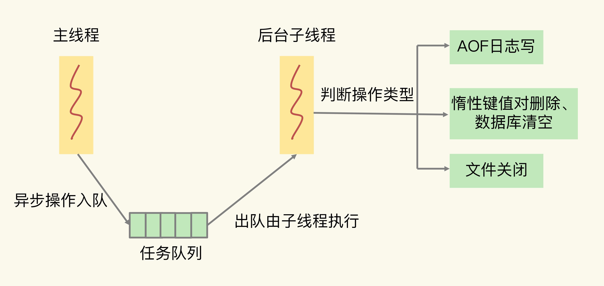
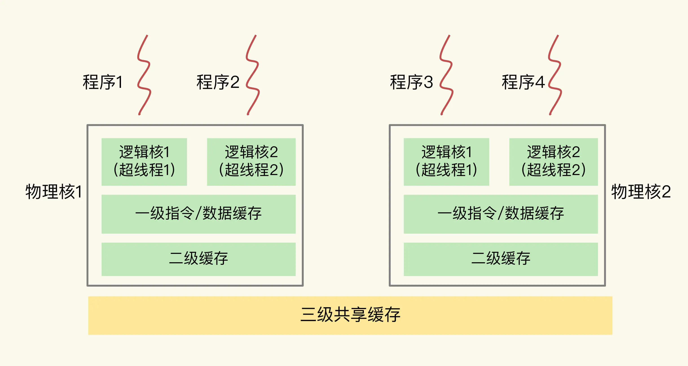
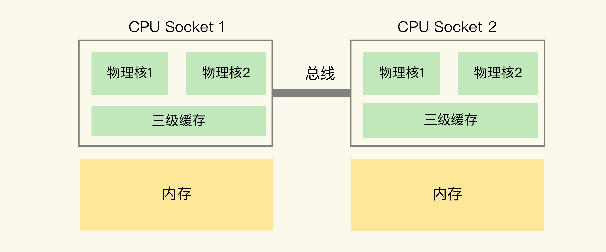
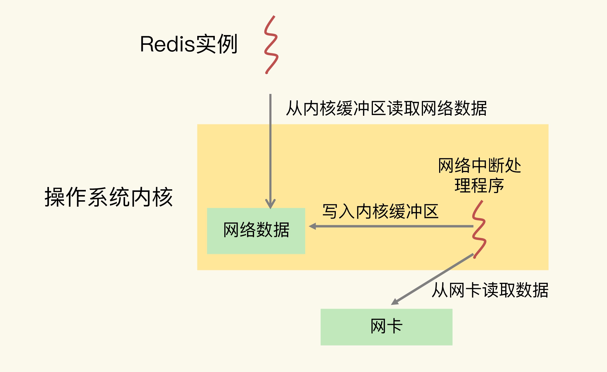

持续记录面试过程中关于Redis的热门问题。


[TOC]

---

# 1.  单线程模型的阻塞点

影响 Redis 性能的 5 大方面的潜在因素，分别是：

- Redis 内部的阻塞式操作；
- CPU 核和 NUMA 架构的影响；
- Redis 关键系统配置；
- Redis 内存碎片；
- Redis 缓冲区


## 1.1 Redis 实例的阻塞点

- **客户端**：网络 IO，键值对增删改查操作，数据库操作；
- **磁盘**：生成 RDB 快照，记录 AOF 日志，AOF 日志重写；
- **主从节点**：主库生成、传输 RDB 文件，从库接收 RDB 文件、清空数据库、加载 RDB 文件；
- **切片集群实例**：向其他实例传输哈希槽信息，数据迁移


### 1.1.1 客户端交互时的阻塞点

网络 IO 有时候会比较慢，但是 Redis 使用了 IO 多路复用机制，避免了主线程一直处在等待网络连接或请求到来的状态，所以，网络 IO 不是导致 Redis 阻塞的因素。

**阻塞点：**

1. 集合全量查询和聚合操作。（操作的复杂度为 O(N)）
2. bigkey 删除操作，删除操作的本质是要释放键值对占用的内存空间，释放内存只是第一步，为了更加高效地管理内存空间，在应用程序释放内存时，操作系统需要把释放掉的内存块插入一个空闲内存块的链表，以便后续进行管理和再分配。这个过程本身需要一定时间，而且会阻塞当前释放内存的应用程序。
3. 清空数据库（涉及到删除和释放所有的键值对）


### 1.1.2 磁盘交互时的阻塞点

Redis 开发者早已认识到磁盘 IO 会带来阻塞，所以就把 Redis 进一步设计为采用子进程的方式生成 RDB 快照文件，以及执行 AOF 日志重写操作。这样一来，这两个操作由子进程负责执行，慢速的磁盘 IO 就不会阻塞主线程了。

**阻塞点**: AOF 日志同步写，一个同步写磁盘的操作的耗时大约是 1～2ms，如果有大量的写操作需要记录在 AOF 日志中，并同步写回的话，就会阻塞主线程了。


### 1.1.3 主从节点交互时的阻塞点

1. 主库在复制的过程中，创建和传输 RDB 文件都是由子进程来完成的，不会阻塞主线程。但是，对于从库来说，它在接收了 RDB 文件后，需要使用 FLUSHDB 命令清空当前数据库，上述已记录此阻塞点。
2. 从库在清空当前数据库后，还需要把 RDB 文件加载到内存，这个过程的快慢和 RDB 文件的大小密切相关，RDB 文件越大，加载过程越慢，所以，加载 RDB 文件就成为了 Redis 的第五个阻塞点。


### 1.1.4 切片集群实例交互时的阻塞点

- 部署 Redis 切片集群时，每个 Redis 实例上分配的哈希槽信息需要在不同实例间进行传递

- 当需要进行负载均衡或者有实例增删时，数据会在不同的实例间进行迁移

不过，哈希槽的信息量不大，而数据迁移是渐进式执行的，所以，一般来说，这两类操作对 Redis 主线程的阻塞风险不大。

**阻塞点：**

如果使用了 Redis Cluster 方案，而且同时正好迁移的是 bigkey 的话，就会造成主线程的阻塞，因为 Redis Cluster 使用了同步迁移。


### 1.1.5 小结

**五个阻塞点：**

- 集合全量查询和聚合操作；
- bigkey 删除；
- 清空数据库；
- AOF 日志同步写；
- 从库加载 RDB 文件


**是否可优化（异步执行不是 Redis 主线程的关键路径上的操作）：**

除了“集合全量查询和聚合操作”和“从库加载 RDB 文件”，其他三个阻塞点涉及的操作都不在关键路径上，所以，我们可以使用 Redis 的异步子线程机制来实现 bigkey 删除，清空数据库，以及 AOF 日志同步写。


Redis 主线程启动后，会使用操作系统提供的 pthread_create 函数创建 3 个子线程，分别由它们负责 AOF 日志写操作、键值对删除以及文件关闭的异步执行。


主线程通过一个链表形式的任务队列和子线程进行交互。当收到键值对删除和清空数据库的操作时，主线程会把这个操作封装成一个任务，放入到任务队列中，然后给客户端返回一个完成信息，表明删除已经完成。但实际上，这个时候删除还没有执行，等到后台子线程从任务队列中读取任务后，才开始实际删除键值对，并释放相应的内存空间。因此，我们把这种异步删除也称为惰性删除（lazy free）。



异步的键值对删除和数据库清空操作是 Redis 4.0 后提供的功能，Redis 也提供了新的命令来执行这两个操作:

- 键值对删除：当你的集合类型中有大量元素（例如有百万级别或千万级别元素）需要删除时，我建议你使用 UNLINK 命令

- 清空数据库：可以在 FLUSHDB 和 FLUSHALL 命令后加上 ASYNC 选项，这样就可以让后台子线程异步地清空数据库

  ```
  FLUSHDB ASYNC
  FLUSHALL AYSNC
  ```

  

### 1.1.6 小建议

 

- 集合全量查询和聚合操作：可以使用 SCAN 命令，分批读取数据，再在客户端进行聚合计算；
- 从库加载 RDB 文件：把主库的数据量大小控制在 2~4GB 左右，以保证 RDB 文件能以较快的速度加载


## 1.2  CPU结构也会影响Redis的性能


### 1.2.1 主流的 CPU 架构

一个 CPU 处理器中一般有多个运行核心，我们把一个运行核心称为一个物理核，每个物理核都可以运行应用程序。每个物理核都拥有私有的一级缓存（Level 1 cache，简称 L1 cache），包括一级指令缓存和一级数据缓存，以及私有的二级缓存（Level 2 cache，简称 L2 cache）。

物理核的私有缓存。它其实是指缓存空间只能被当前的这个物理核使用，其他的物理核无法对这个核的缓存空间进行数据存取。当数据或指令保存在 L1、L2 缓存时，物理核访问它们的延迟不超过 10 纳秒，速度非常快。但是，这些 L1 和 L2 缓存的大小受限于处理器的制造技术，一般只有 KB 级别，存不下太多的数据。

不同的物理核还会共享一个共同的三级缓存（Level 3 cache，简称为 L3 cache）。L3 缓存能够使用的存储资源比较多，所以一般比较大，能达到几 MB 到几十 MB，这就能让应用程序缓存更多的数据。当 L1、L2 缓存中没有数据缓存时，可以访问 L3，尽可能避免访问内存（访存延迟一般在百纳秒级别）。

现在主流的 CPU 处理器中，每个物理核通常都会运行两个超线程，也叫作逻辑核。同一个物理核的逻辑核会共享使用 L1、L2 缓存。




在主流的服务器上，一个 CPU 处理器会有 10 到 20 多个物理核。同时，为了提升服务器的处理能力，服务器上通常还会有多个 CPU 处理器（也称为多 CPU Socket），每个处理器有自己的物理核（包括 L1、L2 缓存），L3 缓存，以及连接的内存，同时，不同处理器间通过总线连接。



在多 CPU 架构上，应用程序可以在不同的处理器上运行。在上图中，Redis 可以先在 Socket 1 上运行一段时间，然后再被调度到 Socket 2 上运行。此时，应用程序再进行内存访问时，就需要访问之前 Socket 上连接的内存，这种访问属于远端内存访问。和访问 Socket 直接连接的内存相比，远端内存访问会增加应用程序的延迟。


**NUMA架构**：在多 CPU 架构下，一个应用程序访问所在 Socket 的本地内存和访问远端内存的延迟并不一致，所以，我们也把这个架构称为非统一内存访问架构（Non-Uniform Memory Access，NUMA 架构）。


### 1.2.2 CPU 多核对 Redis 性能的影响

多核 CPU 的场景下，一旦应用程序需要在一个新的 CPU 核上运行，那么，运行时信息就需要重新加载到新的 CPU 核上。而且，新的 CPU 核的 L1、L2 缓存也需要重新加载数据和指令，这会导致程序的运行时间增加。

如果在 CPU 多核场景下，Redis 实例被频繁调度到不同 CPU 核上运行的话，那么，对 Redis 实例的请求处理时间影响就更大了。每调度一次，一些请求就会受到运行时信息、指令和数据重新加载过程的影响，这就会导致某些请求的延迟明显高于其他请求。

要避免 Redis 总是在不同 CPU 核上来回调度执行。可以使用 taskset 命令把一个程序绑定在一个核上运行。把 Redis 实例绑在了 0 号核上，其中，“-c”选项用于设置要绑定的核编号。

```
taskset -c 0 ./redis-server
```


### 1.2.3 CPU 的 NUMA 架构对 Redis 性能的影响

为了提升 Redis 的网络性能，把操作系统的网络中断处理程序和 CPU 核绑定。这个做法可以避免网络中断处理程序在不同核上来回调度执行，的确能有效提升 Redis 的网络处理性能。

Redis 实例和网络中断程序的数据交互：网络中断处理程序从网卡硬件中读取数据，并把数据写入到操作系统内核维护的一块内存缓冲区。内核会通过 epoll 机制触发事件，通知 Redis 实例，Redis 实例再把数据从内核的内存缓冲区拷贝到自己的内存空间，如下图所示：




**如果网络中断处理程序和 Redis 实例各自所绑的 CPU 核不在同一个 CPU Socket 上，那么，Redis 实例读取网络数据时，就需要跨 CPU Socket 访问内存，这个过程会花费较多时间**。所以，为了避免 Redis 跨 CPU Socket 访问网络数据，我们最好把网络中断程序和 Redis 实例绑在同一个 CPU Socket 上。

**注意：**

**在 CPU 的 NUMA 架构下，对 CPU 核的编号规则，并不是先把一个 CPU Socket 中的所有逻辑核编完，再对下一个 CPU Socket 中的逻辑核编码，而是先给每个 CPU Socket 中每个物理核的第一个逻辑核依次编号，再给每个 CPU Socket 中的物理核的第二个逻辑核依次编号。**

```
lscpu

Architecture: x86_64
...
NUMA node0 CPU(s): 0-5,12-17
NUMA node1 CPU(s): 6-11,18-23
...
```

NUMA node0 的 CPU 核编号是 0 到 5、12 到 17。其中，0 到 5 是 node0 上的 6 个物理核中的第一个逻辑核的编号，12 到 17 是相应物理核中的第二个逻辑核编号。NUMA node1 的 CPU 核编号规则和 node0 一样。


### 1.2.4 绑核的风险和解决方案

当我们把 Redis 实例绑到一个 CPU 逻辑核上时，就会导致子进程、后台线程和 Redis 主线程竞争 CPU 资源，一旦子进程或后台线程占用 CPU 时，主线程就会被阻塞，导致 Redis 请求延迟增加。

两种解决方案，分别是一个 Redis 实例对应绑一个物理核和优化 Redis 源码。

1. 一个 Redis 实例对应绑一个物理核：在给 Redis 实例绑核时，我们不要把一个实例和一个逻辑核绑定，而要和一个物理核绑定，也就是说，把一个物理核的 2 个逻辑核都用上

   ```
   taskset -c 0,12 ./redis-server
   ```

2. 优化 Redis 源码：把子进程和后台线程绑到不同的 CPU 核上


## 1.3 Redis变慢的原因排查


### 1.3.1 Redis是否变慢

1. 查看 Redis 的响应延迟

2. 基于当前环境下的 Redis 基线性能做判断
   从 2.8.7 版本开始，redis-cli 命令提供了–intrinsic-latency 选项，可以用来监测和统计测试期间内的最大延迟，这个延迟可以作为 Redis 的基线性能。

   ```
   ./redis-cli --intrinsic-latency 120
   Max latency so far: 17 microseconds.
   Max latency so far: 44 microseconds.
   Max latency so far: 94 microseconds.
   Max latency so far: 110 microseconds.
   Max latency so far: 119 microseconds.
   
   36481658 total runs (avg latency: 3.2893 microseconds / 3289.32 nanoseconds per run).
   Worst run took 36x longer than the average latency.
   ```

如果你观察到的 Redis 运行时延迟是其基线性能的 2 倍及以上，就可以认定 Redis 变慢了。

如果你想了解网络对 Redis 性能的影响，一个简单的方法是用 iPerf 这样的工具，测量从 Redis 客户端到服务器端的网络延迟。如果这个延迟有几十毫秒甚至是几百毫秒，就说明，Redis 运行的网络环境中很可能有大流量的其他应用程序在运行，导致网络拥塞了。


### 1.3.2 如何应对 Redis 变慢(上-自身特性)

1. **慢查询命令**

Redis 性能变慢时，可以通过 Redis 日志，或者是 latency monitor 工具，查询变慢的请求，根据请求对应的具体命令以及官方文档，确认下是否采用了复杂度高的慢查询命令。

两种处理方式：

- 用其他高效命令代替。比如说，如果你需要返回一个 SET 中的所有成员时，不要使用 SMEMBERS 命令，而是要使用 SSCAN 多次迭代返回，避免一次返回大量数据，造成线程阻塞。
- 当你需要执行排序、交集、并集操作时，可以在客户端完成，而不要用 SORT、SUNION、SINTER 这些命令，以免拖慢 Redis 实例。


因为 KEYS 命令需要遍历存储的键值对，所以操作延时高。如果你不了解它的实现而使用了它，就会导致 Redis 性能变慢。所以，KEYS 命令一般不被建议用于生产环境中。


2. **过期 key 操作**

默认情况下，Redis 每 100 毫秒会删除一些过期 key，具体的算法如下：

- 采样 ACTIVE_EXPIRE_CYCLE_LOOKUPS_PER_LOOP 个数的 key，并将其中过期的 key 全部删除；
- 如果超过 25% 的 key 过期了，则重复删除的过程，直到过期 key 的比例降至 25% 以下。

注意，删除操作是阻塞的（Redis 4.0 后可以用异步线程机制来减少阻塞影响）。所以，一旦该条件触发，Redis 的线程就会一直执行删除，这样一来，就没办法正常服务其他的键值操作了，就会进一步引起其他键值操作的延迟增加，Redis 就会变慢。

避免频繁使用带有相同时间参数的 EXPIREAT 命令设置过期 key，可以在 EXPIREAT 和 EXPIRE 的过期时间参数上，加上一个一定大小范围内的随机数，这样，既保证了 key 在一个邻近时间范围内被删除，又避免了同时过期造成的压力。


### 1.3.3 如何应对 Redis 变慢(下-不合理的配置)

文件系统和操作系统的层面看:
- 文件系统： Redis 会持久化保存数据到磁盘，在持久化的过程中，Redis 也还在接收其他请求。因此持久化的效率高低会影响到 Redis 处理请求的性能
- 操作系统：如果 Redis 的内存不够用了，操作系统会启动 swap 机制，这就会直接拖慢 Redis

1. **文件系统：AOF 模式**

当写回策略配置为 everysec 和 always 时，Redis 需要调用 fsync 把日志写回磁盘。由于 fsync 后台子线程和 AOF 重写子进程的存在（fsync 需要等到数据写到磁盘后才能返回），主 IO 线程一般不会被阻塞。但是，如果在重写日志时，AOF 重写子进程的写入量比较大，fsync 线程也会被阻塞，进而阻塞主线程，导致延迟增加。

解决方案：

- 建议考虑采用高速的固态硬盘作为 AOF 日志的写入设备
- 如果业务应用对延迟非常敏感，但同时允许一定量的数据丢失，那么，可以把配置项 no-appendfsync-on-rewrite 设置为 yes（AOF 重写时，不进行 fsync 操作）

2. **操作系统：swap**

正常情况下，Redis 的操作是直接通过访问内存就能完成，一旦 swap 被触发了，Redis 的请求操作需要等到磁盘数据读写完成才行。而且，和刚才 AOF 日志文件读写使用 fsync 线程不同，swap 触发后影响的是 Redis 主 IO 线程，这会极大地增加 Redis 的响应时间。

触发 swap 的原因主要是物理机器内存不足，对于 Redis 而言，有两种常见的情况：

- Redis 实例自身使用了大量的内存，导致物理机器的可用内存不足；
- 和 Redis 实例在同一台机器上运行的其他进程，在进行大量的文件读写操作。文件读写本身会占用系统内存，这会导致分配给 Redis 实例的内存量变少，进而触发 Redis 发生 swap

解决方案：

- 增加机器的内存或者使用 Redis 集群

如何查看 swap 的使用情况：

```
$ redis-cli info | grep process_id
process_id: 5332

$ cd /proc/5332

$cat smaps | egrep '^(Swap|Size)'
Size: 584 kB
Swap: 0 kB
Size: 4 kB
Swap: 4 kB
Size: 4 kB
Swap: 0 kB
Size: 462044 kB
Swap: 462008 kB
Size: 21392 kB
Swap: 0 kB

每一行 Size 表示的是 Redis 实例所用的一块内存大小，而 Size 下方的 Swap 和它相对应，表示这块 Size 大小的内存区域有多少已经被换出到磁盘上了。如果这两个值相等，就表示这块内存区域已经完全被换出到磁盘了。
```

3. **操作系统：内存大页**

除了内存 swap，还有一个和内存相关的因素，即内存大页机制（Transparent Huge Page, THP），也会影响 Redis 性能。Linux 内核从 2.6.38 开始支持内存大页机制，该机制支持 2MB 大小的内存页分配，而常规的内存页分配是按 4KB 的粒度来执行的。

虽然内存大页可以给 Redis 带来内存分配方面的收益，但是，不要忘了，Redis 为了提供数据可靠性保证，需要将数据做持久化保存。这个写入过程由额外的线程执行，所以，此时，Redis 主线程仍然可以接收客户端写请求。客户端的写请求可能会修改正在进行持久化的数据。在这一过程中，Redis 就会采用写时复制机制，也就是说，一旦有数据要被修改，Redis 并不会直接修改内存中的数据，而是将这些数据拷贝一份，然后再进行修改。

如果采用了内存大页，那么，即使客户端请求只修改 100B 的数据，Redis 也需要拷贝 2MB 的大页。相反，如果是常规内存页机制，只用拷贝 4KB。两者相比，你可以看到，当客户端请求修改或新写入数据较多时，内存大页机制将导致大量的拷贝，这就会影响 Redis 正常的访存操作，最终导致性能变慢。

**如何关闭内存大页？**

```
cat /sys/kernel/mm/transparent_hugepage/enabled

如果执行结果是 always，就表明内存大页机制被启动了；如果是 never，就表示，内存大页机制被禁止

关闭内存大页机制：

echo never /sys/kernel/mm/transparent_hugepage/enabled
```

总结：

在遇到 Redis 性能变慢时，按照这些步骤逐一检查，高效地解决问题。

1. 获取 Redis 实例在当前环境下的基线性能。
2. 是否用了慢查询命令？如果是的话，就使用其他命令替代慢查询命令，或者把聚合计算命令放在客户端做。
3. 是否对过期 key 设置了相同的过期时间？对于批量删除的 key，可以在每个 key 的过期时间上加一个随机数，避免同时删除。是否存在 bigkey？ 
4. 对于 bigkey 的删除操作，如果你的 Redis 是 4.0 及以上的版本，可以直接利用异步线程机制减少主线程阻塞；如果是 Redis 4.0 以前的版本，可以使用 SCAN 命令迭代删除；对于 bigkey 的集合查询和聚合操作，可以使用 SCAN 命令在客户端完成。
5. Redis AOF 配置级别是什么？业务层面是否的确需要这一可靠性级别？如果我们需要高性能，同时也允许数据丢失，可以将配置项 no-appendfsync-on-rewrite 设置为 yes，避免 AOF 重写和 fsync 竞争磁盘 IO 资源，导致 Redis 延迟增加。当然， 如果既需要高性能又需要高可靠性，最好使用高速固态盘作为 AOF 日志的写入盘。
6. Redis 实例的内存使用是否过大？发生 swap 了吗？如果是的话，就增加机器内存，或者是使用 Redis 集群，分摊单机 Redis 的键值对数量和内存压力。同时，要避免出现 Redis 和其他内存需求大的应用共享机器的情况。
7. 在 Redis 实例的运行环境中，是否启用了透明大页机制？如果是的话，直接关闭内存大页机制就行了。
8. 是否运行了 Redis 主从集群？如果是的话，把主库实例的数据量大小控制在 2~4GB，以免主从复制时，从库因加载大的 RDB 文件而阻塞。
9. 是否使用了多核 CPU 或 NUMA 架构的机器运行 Redis 实例？使用多核 CPU 时，可以给 Redis 实例绑定物理核；使用 NUMA 架构时，注意把 Redis 实例和网络中断处理程序运行在同一个 CPU Socket 上。