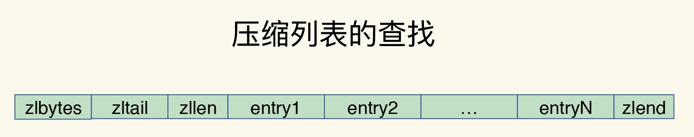
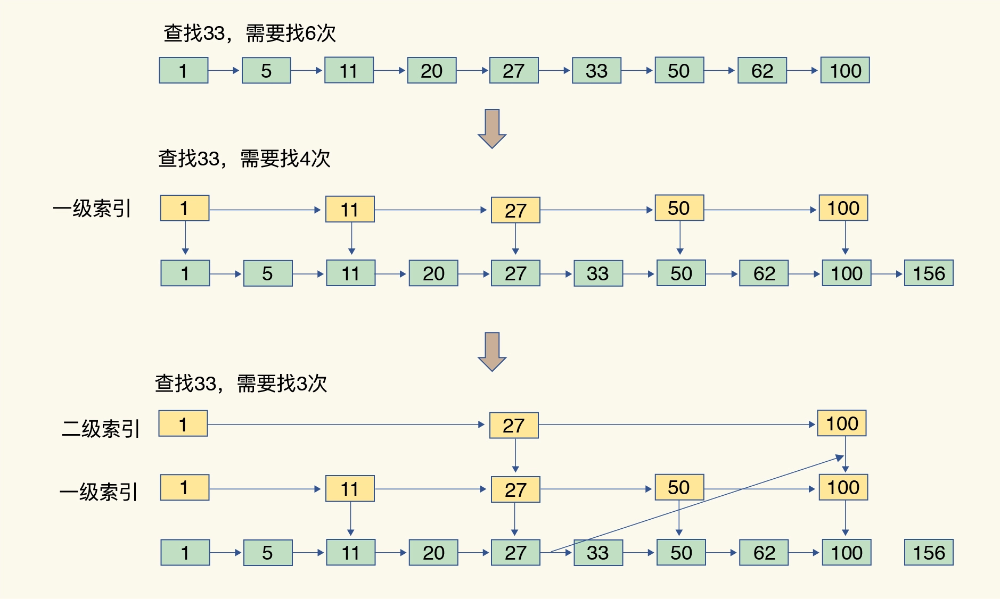
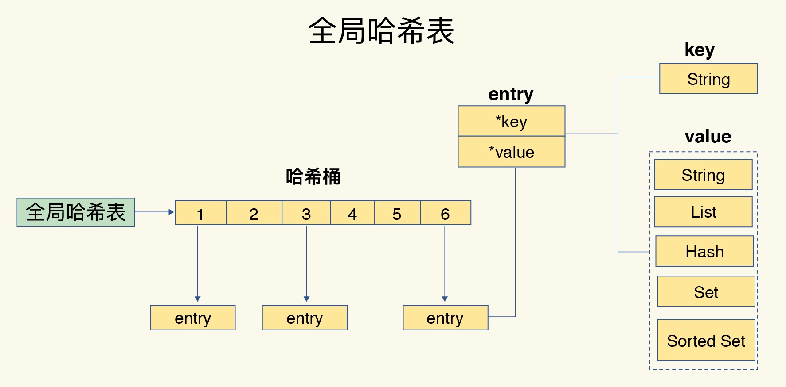

持续记录面试过程中关于Redis的热门问题。

[TOC]

---

## 1. Redis 数据结构

Redis 键值对中值的数据类型，也就是数据的保存形式，共有五种：

String（字符串）、List（列表）、Hash（哈希）、Set（集合）和 Sorted Set（有序集合）。

底层数据结构一共有 6 种，分别是简单动态字符串、双向链表、压缩列表、哈希表、跳表和整数数组。

**压缩列表**

类似于一个数组，数组中的每一个元素都对应保存一个数据。和数组不同的是，压缩列表在表头有三个字段 zlbytes、zltail 和 zllen，分别表示列表长度、列表尾的偏移量和列表中的 entry 个数；压缩列表在表尾还有一个 zlend，表示列表结束。

​        **特点：** 要查找定位第一个元素和最后一个元素，可以通过表头三个字段的长度直接定位，复杂度是 O(1)。而查找其他元素时，就没有这么高效了，只能逐个查找，此时的复杂度就是 O(N) 了。

**跳表**

有序链表只能逐一查找元素，导致操作起来非常缓慢，于是就出现了跳表。具体来说，跳表在链表的基础上，增加了多级索引，通过索引位置的几个跳转，实现数据的快速定位。

**总结**

**Q1.整数数组和压缩列表在查找时间复杂度方面并没有很大的优势，那为什么 Redis 还会把它们作为底层数据结构呢？ ？**

展开

    1、内存利用率，数组和压缩列表都是非常紧凑的数据结构，它比链表占用的内存要更少。Redis是内存数据库，大量数据存到内存中，此时需要做尽可能的优化，提高内存的利用率。
    2、数组对CPU高速缓存支持更友好，所以Redis在设计时，集合数据元素较少情况下，默认采用内存紧凑排列的方式存储，同时利用CPU高速缓存不会降低访问速度。当数据元素超过设定阈值后，避免查询时间复杂度太高，转为哈希和跳表数据结构存储，保证查询效率。

## 2. 全局哈希表和rehash

为了实现从键到值的快速访问，Redis 使用了一个哈希表来保存所有键值对。一个哈希表，其实就是一个数组，数组的每个元素称为一个哈希桶。所以，我们常说，一个哈希表是由多个哈希桶组成的，每个哈希桶中保存了键值对数据。不过，哈希桶中的元素保存的并不是值本身，而是指向具体值的指针。这也就是说，不管值是 String，还是集合类型，哈希桶中的元素都是指向它们的指针。

**全局哈希表的最大好处很明显，就是让我们可以用 O(1) 的时间复杂度来快速查找到键值对——我们只需要计算键的哈希值，就可以知道它所对应的哈希桶位置，然后就可以访问相应的 entry 元素。但随之而来的一个潜在风险点，那就是哈希表的冲突问题和 rehash 可能带来的操作阻塞。**

- Redis 解决哈希冲突的方式，就是链式哈希。即同一个哈希桶中的多个元素用一个链表来保存，它们之间依次用指针连接。但链表越长，查询效率就越低，因此需要rehash
- rehash 也就是增加现有的哈希桶数量，让逐渐增多的 entry 元素能在更多的桶之间分散保存，减少单个桶中的元素数量，从而减少单个桶中的冲突。为了使 rehash 操作更高效，Redis 默认使用了两个全局哈希表：哈希表 1 和哈希表 2。一开始，当你刚插入数据时，默认使用哈希表 1，此时的哈希表 2 并没有被分配空间。随着数据逐步增多，Redis 开始执行 rehash，这个过程分为三步：
  - 给哈希表 2 分配更大的空间，例如是当前哈希表 1 大小的两倍；
  - 把哈希表 1 中的数据重新映射并拷贝到哈希表 2 中（涉及大量的数据拷贝，如果一次性把哈希表 1 中的数据都迁移完，会造成 Redis 线程阻塞，无法服务其他请求，故采用了渐进式 rehash）；
  - 释放哈希表 1 的空间

**渐进式 rehash：**每处理一个请求时，从哈希表 1 中的第一个索引位置开始，顺带着将这个索引位置上的所有 entries 拷贝到哈希表 2 中；等处理下一个请求时，再顺带拷贝哈希表 1 中的下一个索引位置的 entries。这样就巧妙地把一次性大量拷贝的开销，分摊到了多次处理请求的过程中，避免了耗时操作，保证了数据的快速访问。

## 3. Redis是单线程？

**Redis的单线程问题，灵魂三连问：**

展开

    1.redis真的只有单线程吗？   
    &emsp;单线程是指网络io和数据读写操作是由一个线程完成的。数据清理，持久化，主从复制也使用到了其他线程。  
    2.为什么使用单线程？  
    &emsp;避免多线程开发的并发控制问题，且多线程开发代码复杂，可维护性差。  
    3.单线程为什么这么快？ 
    &emsp;内存+高效的数据结构+io多路复用

